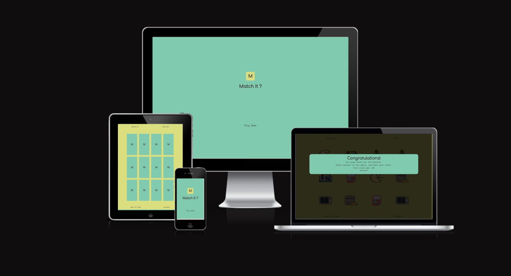
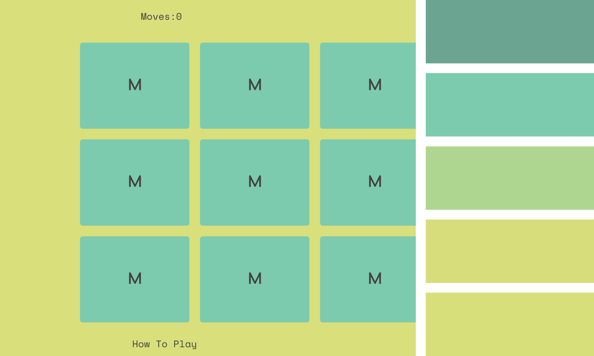
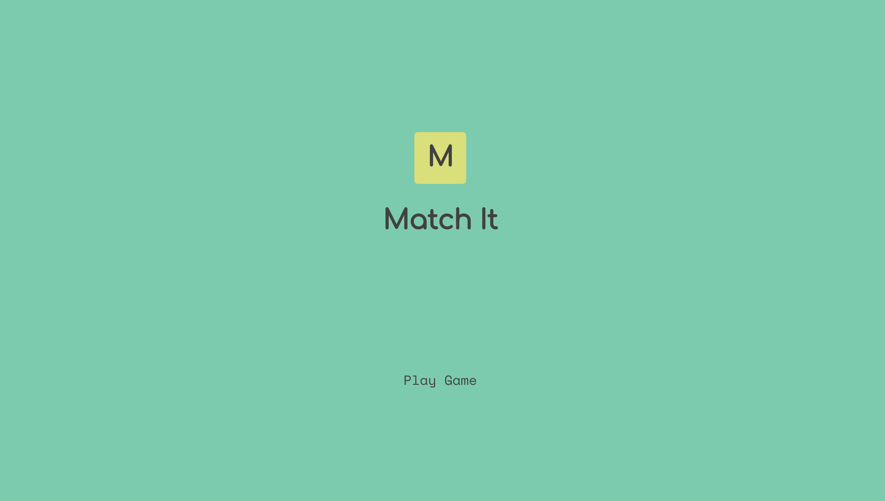
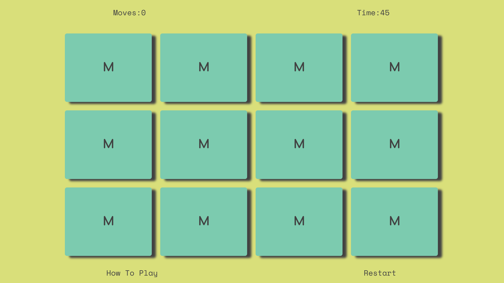
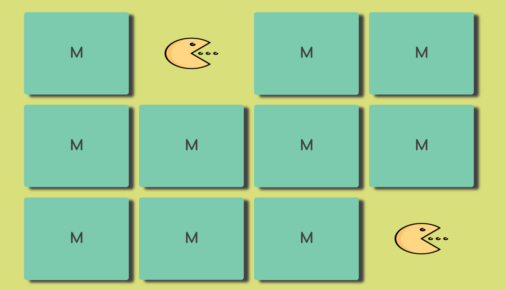

# MATCH IT


This is the Match It game. A memory game, designed for kids. The game consists of 12 cards, placed face down. The card faces have 12 images, 6  pairs of images, the aim is to find each set of pairs. The user can click on a card or touch on screen, to flip it over to reveal the card face. A second card then has to be flipped. If the images on these two cards match they will stay flipped over, and change colour. If they are not a match they will flip back over, so the user can no longer see the images. Another two cards can then be flipped, to try and find a matching pair. The idea is the user has to remember which card has which image, allowing them to find all the matching pairs. There is a time limit, so they must find all the pairs before the clock runs out.

This is a simple game, easy to figure out, but engaging. Can be played in a short amount of time. It is fun and helps to develop memory skills. Not meant to be played for hours on end, so it is ideal for parents to allow kids to play, in short bursts. It is quick for the user to understand the rules, and can start a game instantly at any stage. On the go with a smart phone or tablet, or at home with a laptop or desktop.

Once the page has loaded the cards will be shuffled in to a random order. The game begins, on the first click of a card, starting the timer and counting the number of moves / flips.If completed, and all 6 pairs have been found before the timer runs out. A congratulations modal if pop up, telling the user the number of moves they completed the game in. From that modal they can restart the game, which will re-shuffle the cards into a new random order.If the game is not completed within the time, a similar modal will appear letting them know they have not succeded. The game can be restarted from this modal also, bringing the user back to the main game area.

Although this is aimed at a youger audience it has not been made too childish or gaudish, encouraging people all ages to give it a go, either to compete with thir kids or simply as a quick mental break from the grind, while having a coffee break, or even on the toilet :). A quick game can clear the head, and be a break from aimless social media scrolling. Stimulating but not too challenging. It can also lead to some competitiveness, trying to beat someone elses score or just your own score. 

The design is simple, all on one webpage,with very little navigating. A landing area with nothing but a logo, and a play game button. Once the play game button is clicked the page will automatically slide down to he main game area. The background colour changes, and the 12 cards, face down appear in a grid.

Above the card grid, are two features. The move counter and the timer. Below the grid are two clickable pieces of text. The restart button allowing the user to restart the game at any point. And a how to play button, this when clicked will slide the page down to a section where the instuctions on how to play the game, are shown. Finally below this is a simple footer with the creaters name.

All these sections are coloured with the same scheme, alternating the background colors, as you scroll down. 

It is designed to be fresh, stimulating and as apealling visually to adults and kids.
The images used on the face of the cards, are a throwback to old retro games, images of a gameboy, old console, a joystick, a mario feature, pacman and a screen with an old ping pong game.
This is meant to resonate with older players of the game and also being colourful and fun for the youger users, which through reseach with my own kids still love playing the old retro games.



[responsive mock-up image creater](https://ui.dev/amiresponsive?url=https://dylankane.github.io/Match-It)


## UX & UI


This  game has been designed to encourage use by all ages, but primarily a younger user. The application is very easy to navigate, scrolling to the different sections, or clicking the links in each area to slide to other sections. No navigation buttons to other pages, no back button interaction needed, quick to figure out and simple intructions in as few words as possible. Very little reading needed for kids that might need help reading long pieces of text. The appication has a fun asthetic, with a basic memory skill game , important kids dont think it is too educational.

The colours are inviting and stimulating, without beig too gaudish. The same two colours running through the site, are used to differenciate between sections and also link them altogether at the same time. The typography used for the majority of the text has a retro feel linking it astethically to the retro images on the card faces. It's smooth and flows well. It loops back to the main game area easily from all areas and modals.

The simplicity of the game and its short gameplay time makes it a game, parents will be more comfortable with younger kids playing, while also being convineint for adults to play casually.

### Colour Scheme

Below is a list of the colours used in the application.
The first two are the main colours, on which the whole scheme is based (yellow and green) They have a good contrast with each other but actually close to each other on the colour wheel.) The backgrounds of different sections alternate between these two colours, while features like the cards in the game, are coloured in the alternative to the background, until a pair is matched, changing to them to the background colour. 

The grey colour is used for all the text on the site, with the black colour used as a highlight on the text when the cursor hovers over clickable text. A dotted line also apperars underneath the  clickable text/links when hovered. When either the time up modal or the congratulations modal pops up, the surrounding window is coloured black, with an opacity of 0.8, allowing the page to be seen through it.

- `#d9df7a` used as one of two primary background colours. (A yellow colour)
- `#7ccbaf` the scond of two primary background colours. (A green colour)
- `#414141` used for primary text. (A dark grey)
- `#000000` used for secondary highlights. (Black)


I created the colour scheme myself but here is an image of it visualised on a palette creater. 

[colour palette created using coolors.co ](https://coolors.co/7ccbaf-d9df7a-414141-000000)


I've used CSS `:root` variables to easily update the global colour scheme by changing only one value, instead of everywhere in the CSS file.

```css
:root {
    --yellow: rgb(217, 223, 122);
    --green: rgb(124, 203, 175);
    --grey: rgb(65, 65, 65);
    --highlight: rgb(0, 0, 0);
}
```

### Typography

I have used two fonts for the text on this application. The font "Comfotaa" and the font "Space Mono".I used google fonts for these. Below is a link to the two fonts.


The "Comfortaa" font has a nice playful look with rounded edges that looks particularly well with the logo. It is only used for h1 and h2 elements.

- "Comfortaa is a rounded geometric sans-serif type design intended for large sizes." (Description form Google Fonts)


The rest of the text is in the "Space Mono". This text font has a retro feel, which I think goes well with the images used on the cards, and gives a nostalgic feel to the game.

- "Space Mono is an original fixed-width type family designed by Colophon Foundry for Google Design......Developed for editorial use in headline and display typography, the letterforms infuse a geometric foundation and grotesque details with qualities often found in headline typefaces of the 1960s, many of which have since been co-opted by science fiction films, television, and literature." (Decription from Google Fonts)


- [Comfortaa](https://fonts.google.com/specimen/Comfortaa) was used for the primary headers and titles.

- [Space Mono](https://fonts.google.com/specimen/Space+Mono) was used for all other secondary text.


Sans Seriff was set in all cases as a back up font in the font family in the style.css file.


## Features

In this section I will run through the different features of the project, what their intended use is, and how they work.
I will then go through some possible features that could be added, to improve the game and its site. Creating an even better experience for the user.

### Existing Features

- **Landing Area**

This is where the user lands on loading the page. It takes up 100% of the viewport / window. Basically the header of the page but acts more as the opening area to the game. It's simply made up of the logo of the game with the name / title under it. Below this is a button / link with the text of "Play Game". This play game link, will scroll the page down to the main game area, it can also be manually scrolled down to. The background colour is the main green colour, listed above in the colour scheme section. The logo which is an "M" in a yellow card, to symbolise the cards of the game area that have to be flipped. When the Play game is hovered over, it turns black and is underlined with a black dotted line, consistent with all clickable text on the site.
This area is a clear identifier to the user where they are, with one function, to click "play game" to lead them to the game area. It asthetically sets the theme of the site.




- **Main Game Area**

Once scrolled down from the landing area the user will be brought directly to the main game area. This consits of 3 main features, described in depth below. The status bar, the game board, and the controls bar. the main game area, is in keeping with the asthetics of the site. the background colour changes to the yellow, marking it as a clear change from the landing area. the game has already been loaded when the page loaded so everything is ready to go. 




- **Status Bar**

This feature is above the game board, and consits of two pieces, the moves counter and the time counter. 

The moves counter does as it implies counts the number of moves or flips the user has played in the current game. It is set to zero, until the first card of a particular game is clicked. It will count every single flip of a game until either the time runs out or until the user finds all the matches. This is a key feature of the game. While the main aim is to find all the matches before the timer runs out, this ability to count the number of moves it took to complete, encourages the user to keep trying the game in order to complete it in less moves,  more fun and competitivness! The functionality of the move counter is contained in the script.js file, counting the clicks on cards and updating the index.html file with each flip.

The timer counter is set to 45 seconds on loading the page, and doesn't start to count down until the user clicks the first card. If the timer reaches zero before all pairs have been found, a "times up" modal will appear, ending the current game. If the user finds all the pairs before the clock runs down a different modal will appear, congratulating them on completing the game. It is a very important feature of the game, facing the clock the user is put under pressure to click cards quickly, making previously flipped cards hard to remember. This clock is adjustable from the script.js file, I currently have it set at 45 seconds, challenging enough for younger users but not impossible to complete. It can be changed from one variable within the JavaScript code, defined high up in the line of code, and easily found. In the future features I will talk about this. In the script.js file the clock as a fuction is controlled by other events, starting it, stopping it and resetting it.

The status bar, which features both these objects, sits above the main game board, easliy seen while playing the game, allowing the user to see the status of the current game they are playing. 


- **Game Board**

This is the area where the game takes place. Made up of a grid of 12 cards. Each card begins face down, the back of each card has the logo of the game "M" in the centre of it. On the hidden face there is one of 6 different images, two pairs of each image. When the user clicks on a card or taps on one with a touchscreen, the card will flip over, with an animation using css styling in the style.css file. This will reveal the face of the card with the image. The user can then click any other of the 11 cards. If image on the two cards that are now flipped face up, match, they will change colour to the yellow, from the green colour, used throughout the project. The images will stay visible on the matched pairs. The user can then go on to flipp another two cards. If they flip two cards that dont have matching images, the cards will flip back over, hiding the images again. The user must continue to flip cards in sets of two until they find all the pairs or until the time runs out. Once the second card has been flipped if not a match the cards flip back over after 1.5 seconds and if a match they change colour after 0.7 seconds, allowing the flip animation to happpen smoothly, andtime for the user to register what has happened. While this is happening, the board is locked and another card cant be flipped until the timeout has finished, stopping three or more cards been flipped at once. When not matched the cards are styled with the green from the sites colour scheme, with rounded corners and box shadowing applied to give the illusion they are raised off the board. these style features are applies within the style.css file of the project.

The cards are created in the index.html file, along with the "M" logo and the image on the face. This makesadding changing or removing cards easy, without having to interfere with the JavaScript code.

Their order is shuffled on loading of the page, by a function called "suffle" in the script.js file. They are also randomly shuffled when the game is restarted from either the button/link under the game board or from either of the two pop up modals, as well as the two "Play Game" buttons/links in the landing area and the intructions area (the "play Game" re shuffle and bring the user to the game board).
The script.js file, contains the code to activate the flips, compare if they are matches act on that comparison and what happens when the time runs out or all matches are found. 
   

- **Modals**

- **Instructions Area**

- **Footer**


### Future Features

Here I will list a few ideas I have for the future to furthuer develop this project:

- Add option to change the images on the cards by theme
    - A future feature that would be nice to add, is allowing the user to change the images that are on the face of the cards, this could be done by choosing from preset themes that include sets of images. his would be particularly interesting for kids. It could also include more educational content like finding matching words from different languages.

- Add the ability to adjust the timer, by selecting an easy medium or hard level
    - The difficulty level of the game could be increased or decreased by adjusting the timer. more time to complete making it easier or less to make it more difficult.

- Add the option to increase or decrease the number of cards, 6, 12, 24 etc.
    - Another way to increase its difficulty level would be adding more cards, also having less cards could introduce an even younger audience.

- Add a highscore counter that can store locally what the users highest score has been.
    - A simple highscore counter could be added to the game allowing the user to see their previous highest score, this could be done locally just storing on the browser.

-Add a leaderboard where all userof the game have a chance to compete for spots on the leaderboard.
    -A more detailed leaderboard could also be added in the future, getting the user to enter their name or initials. Then storing their score on a leaderboard, showing the top 10 scores with their usernames.


## Tools & Technologies Used

In this section, I will list the various tools and technologies used to develop the project. With a link explaining in depth what these tools / technologies are.


- [HTML](https://en.wikipedia.org/wiki/HTML) used for the main site content.
- [CSS](https://en.wikipedia.org/wiki/CSS) used for the main site design and layout.
- [CSS :root variables](https://www.w3schools.com/css/css3_variables.asp) used for reusable colour scheme throughout the site.
- [CSS Flexbox](https://www.w3schools.com/css/css3_flexbox.asp) used for styling and controlling many elements for good responsiveness
- [JavaScript](https://www.javascript.com) used for user interaction on the site and the main functionallity of the game.
- [Git](https://git-scm.com) used for version control. (`git add`, `git commit`, `git push`)
- [GitHub](https://github.com) used for secure online code storage.
- [GitHub Pages](https://pages.github.com) used for hosting the deployed front-end site.
- [Gitpod](https://gitpod.io) used as a cloud-based IDE for development.
- [Markdown Builder by Tim Nelson](https://traveltimn.github.io/markdown-builder) used to help generate the Markdown files.


## Testing

For all testing, please refer to the [TESTING.md](TESTING.md) file.

## Deployment

The site was deployed to GitHub Pages. The steps to deploy are as follows:
- In the [GitHub repository](https://github.com/dylankane/Match-It), navigate to the Settings tab 
- From the source section drop-down menu, select the "Main" Branch, then click "Save".
- The page will be automatically refreshed with a detailed ribbon display to indicate the successful deployment.

The live link can be found [here](https://dylankane.github.io/Match-It)

### Local Deployment

This project can be cloned or forked in order to make a local copy on your own system.

#### Cloning

You can clone the repository by following these steps:

1. Go to the [GitHub repository](https://github.com/dylankane/Match-It) 
2. Locate the Code button above the list of files and click it 
3. Select if you prefer to clone using HTTPS, SSH, or GitHub CLI and click the copy button to copy the URL to your clipboard
4. Open Git Bash or Terminal
5. Change the current working directory to the one where you want the cloned directory
6. In your IDE Terminal, type the following command to clone my repository:
	- `git clone https://github.com/dylankane/Match-It.git`
7. Press Enter to create your local clone.

Alternatively, if using Gitpod, you can click below to create your own workspace using this repository.

[](https://gitpod.io/#https://github.com/dylankane/Match-It)

Please note that in order to directly open the project in Gitpod, you need to have the browser extension installed.
A tutorial on how to do that can be found [here](https://www.gitpod.io/docs/configure/user-settings/browser-extension).

#### Forking

By forking the GitHub Repository, we make a copy of the original repository on our GitHub account to view and/or make changes without affecting the original owner's repository.
You can fork this repository by using the following steps:

1. Log in to GitHub and locate the [GitHub Repository](https://github.com/dylankane/Match-It)
2. At the top of the Repository (not top of page) just above the "Settings" Button on the menu, locate the "Fork" Button.
3. Once clicked, you should now have a copy of the original repository in your own GitHub account!


## Credits

In this section I will reference where I got my content, media, and extra help from, while creating this project.


### Content

Here I will list attribution links to any borrowed code snippets, articles, or resources. There will be tutorials that I followed to create certain sections of the roject, where the code will be copied, some parts changed and some parts modified to get the result I was looking for.


| Source | Location | Notes | 

| [freecodecamp.org (youtube)](https://www.youtube.com/watch?v=ZniVgo8U7ek) | [freecodecamp.org(github)](https://github.com/code-sketch/memory-game/) | main game board JavaScript code (game functionality) | I used some direct code some modified and general info from this tutorial to figure out how to make the main game work, on the javascript side and the css for flipping the cards | 

| [Code Grind (youtube)](https://www.youtube.com/watch?v=B6aJpbX_IZU) | main game board JavaScript code (game functionality) | I used some direct code some modified and general info from this tutorial to figure out how to make the main game work, on the javascript side | 

| [StackOverFlow](https://stackoverflow.com/questions/3536055/stopping-a-javascript-function-when-a-certain-condition-is-met) | Used in flipcard function in the script.js | Helped me understand stopping a function under certain criteria |

| [W3Schools](https://www.w3schools.com/howto/howto_css_modals.asp) | main game area (modals) | Used to create interactive pop-up (modal) when the game time runs out or is completed |

| [Traversy media (youtube)](https://www.youtube.com/watch?v=6ophW7Ask_0&t=1446s) | main game area (modals) | helped to understand how the modal works |

| [w3schools](https://www.w3schools.com/jsref/event_onclick.asp) | to exit from modals | Helped me to understand and modify code to exit a modal by clicking the surrounding area with on-click events |

| [DThompsonDev (youtube)](https://www.youtube.com/watch?v=IOlnFbVLE8s) | timer countdown clock | tutorial used to build the timer countdown clock in the main game area |

| [codepen](https://codepen.io/masudrana2779/pen/GRqzPdZ) | Timer clock | used to help coding the timer cock |

| [mdn web docs](https://developer.mozilla.org/en-US/docs/Web/API/setTimeout)  | main game | used to to figure out how the timeout feature works to delay the cards flipping back over, seen it used in first two tutorials listed here |

| [mdn web docs](https://developer.mozilla.org/en-US/docs/Web/JavaScript/Reference/Global_Objects/Array/forEach) | mutiple parts of the JavaScript code| Helped me to understand how the for each loop on an array worked, after seeing them used in tutorials, allowing me to use them in my own code |

| [StackOverFlow](https://stackoverflow.com/questions/26848289/queryselector-vs-getelementbyid) | mutiple parts of the JavaScript code | helped me to utilise the querySelectorAll feature in JavaScript |

| [mdn web docs](https://developer.mozilla.org/en-US/docs/Web/CSS/pointer-events) | multipe element selectors in the style.css file| used to understand pointer events to be used across the project |

| [css-tricks.com](https://css-tricks.com/snippets/css/a-guide-to-flexbox/) | style.css | Helped to refresh my understanding of flex box styling in css, used across whole project |

| [mdn web docs](https://developer.mozilla.org/en-US/docs/Web/CSS/box-shadow) | css for main game board | Used to figure out the syntax for box shadowing on the cards |

| [Markdown Builder by Tim Nelson](https://traveltimn.github.io/markdown-builder) | README and TESTING | tool to help generate the Markdown files |

| [Tim Nelson](https://github.com/TravelTimN) | JavaScript | Helped me out a lot with fixing bugs with the timer clock resetting, locking the board from clicks during flipping and un-flipping, fixing commit messages and how to log them more efficiently |


### Media

| Source | Location | Type | Notes |

| [ping pong game image/icon](https://www.freepik.com/free-icon/television_14013058.htm#page) | main game board | image in png format | Used as an image for the face of the cards in the game board |

| [gameboy image/icon](https://www.freepik.com/free-icon/game_14829408.htm#page) | main game board | image in png format | Used as an image for the face of the cards in the game board |

| [pac-man image/icon](https://www.freepik.com/free-icon/gamer_14235636.htm#page) | main game board | image in png format | Used as an image for the face of the cards in the game board |

| [mario graphic image/icon](https://www.freepik.com/free-icon/video-game_14356547.htm#) | main game board | image in png format | Used as an image for the face of the cards in the game board |

| [retro console image/icon](https://www.freepik.com/free-icon/console_14383364.htm#) | main game board | image in png format | Used as an image for the face of the cards in the game board |

| [joystick image/icon](https://www.freepik.com/free-icon/joypad_15272140.htm#) | main game board | image in png format | Used as an image for the face of the cards in the game board |


### Acknowledgements


- I would like to thank my Code Institute mentor, [Tim Nelson](https://github.com/TravelTimN) for their support throughout the development of this project. His amazing patience while going through bugs and other issues with me during our meetings.

- I would like to thank the [Code Institute Slack community](https://code-institute-room.slack.com) for the moral support,for always having someone to have a look and help with problems iI was having, and an abundance of previously asked questions which ofen had the answer I was looking for.

- I would like to thank my 7 year old son Liam , for helping me with the market research on this project, playing many many online games until he became an expert and my advisor. 
