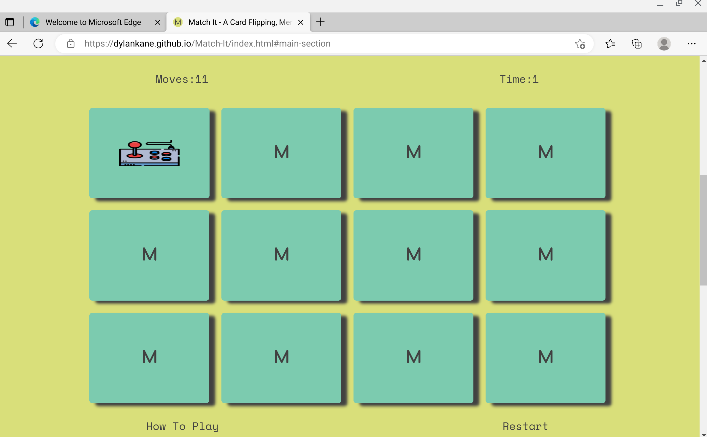
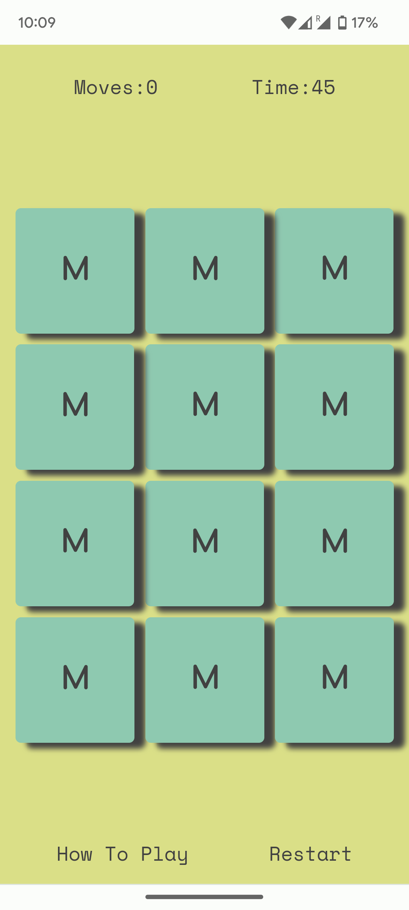
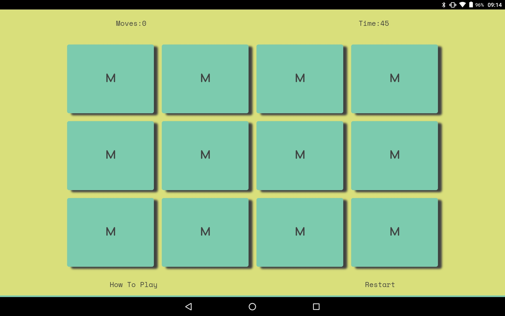
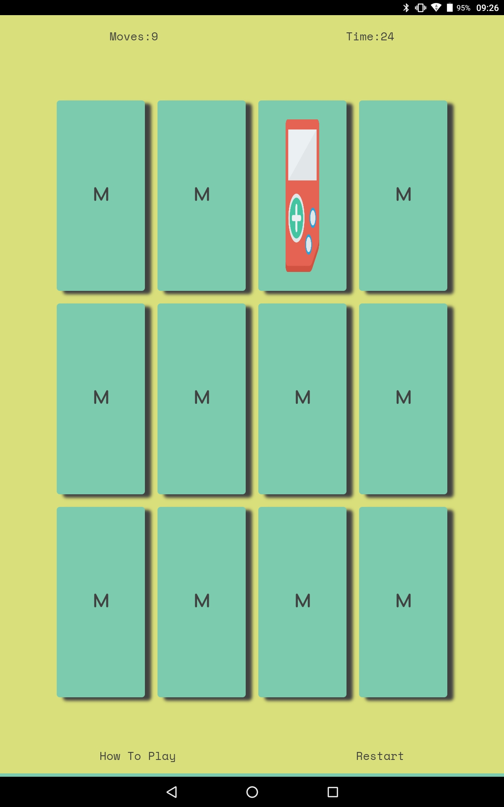

# Testing

Return back to the [README.md](README.md) file.

In this section I will outline the tests I have put this project through, and the results of those tests

## Code Validation

### HTML

I have used the recommended [HTML W3C Validator](https://validator.w3.org) to validate all of my HTML files. I have used the deployed live site to test this.

| Page | URL | Screenshot | Notes |
| --- | --- | --- | --- |
|Single Page|[w3c HTML](https://validator.w3.org/nu/?doc=https%3A%2F%2Fdylankane.github.io%2FMatch-It%2F)||Pass: No Errors

### CSS

I have used the recommended [CSS Jigsaw Validator](https://jigsaw.w3.org/css-validator) to validate all of my CSS files. I have used to live deployed site for this validation test.

| Page | URL | Screenshot | Notes |
| --- | --- | --- | --- |
|Single File|[w3c CSS](https://jigsaw.w3.org/css-validator/validator?uri=https%3A%2F%2Fdylankane.github.io%2FMatch-It%2F)||Pass: No Erorrs| 

### JavaScript

I have used the recommended [JShint Validator](https://jshint.com) to validate all of my JS files.

| File | Screenshot | Notes |
| --- | --- | --- |
|script.js||"One warning 69 Confusing use of '!'". ( on line 57 of the actual script.js file, the validation found the use of the '!' to be confusing I did origanally write it differently, but I found this way to be less confusing)|

## Browser Compatibility

I've tested my deployed project on multiple browsers to check for compatibility issues.

| Browser | Screenshot | Notes |
| --- | --- | --- |
| Chrome |  | Works as expected |
| Firefox |  | Works as expected |
| Edge |  | Scrooling wasnt very smooth, and images on card faces were a bit stretched |

## Responsiveness

I've tested my live deployed project on multiple devices to check for responsiveness issues.

| Device | Screenshot | Notes |
| --- | --- | --- |
|Mobile (pixel 6a)||Works as expected|
|Tablet landscape (lenovo)||Works as expected|
|Tablet portrait  (lenovo)||Issues with images on cards stretching|
|Laptop (pixelbook)||Works as expected|
|Large Monitor (samsung)||Works as expected|

## Lighthouse Audit

I have also tested my live deployed site using the Lighthouse Audit tool. Done from within he dev tools in chrome. Below are the results.

| Page | Size | Screenshot | Notes |
| --- | --- | --- | --- |
|Single page|Laptiop||No warnings |
|Single Page|Mobile||No warnings|

## Defensive Programming

I have manually test the user interface of this application. The following table shows the different points of interaction, between the user and site, with the test and result.

| Page | User Action | Expected Result | Pass/Fail | Comments |
| --- | --- | --- | --- | --- |
|Single Page site|"Play Game" link in header|scrolls to game board area|pass|works as expected|
|Single Page site|"Restart" link under game board|re-sets game, (shuffle, moves to 0, clock to 45)|pass|works as expected|
|Single Page site|"How To Play" link uneder game board|scrolls to instruction area|pass|works as expected|
|Single Page site|"Play Game" link in intructions area|scrolls to game board and re-sets game |pass|works as expected|
|Single Page site|"Restart" link in time up modal|closes modal and re-sets game|pass|works as expected|
|Single Page site|"Restart" link in congratulations modal|closes modal and re-sets game|pass|works as expected|
|Single Page site|Clicking a card on the game board|Flips the card over and shows image|pass|works as expected|
|Single Page site|clicking a second card on the game board|Flips a second card shows image, locks other cards from being clicked, if matched two card change colour and are disables from being clicked, if not, will flip back over. the board will be unlocked after either outcome, ready for another two clicks|pass| works as expected|

## Bugs

In the development of this project there were a number of bugs I came across. Below is a list of some bigger issues I has and how I fixed them:

- JS Uncaught ReferenceError: `foobar` is undefined/not defined

    

    - To fix this, I _____________________.

- JS `'let'` or `'const'` or `'template literal syntax'` or `'arrow function syntax (=>)'` is available in ES6 (use `'esversion: 11'`) or Mozilla JS extensions (use moz).

    

    - To fix this, I _____________________.

## Unfixed Bugs

 Below is a list of bugs / issues with the project, that i am aware of, with screenshots and possible fixes:

- On some screen sizes and certain browsers the images on the face of the cards, are being stretched, afecting their appearance. While still usable for the purpose of the game they have to be fixed. This is seen below in the two screenshots. 

     
    

    - Attempted fix: i have applied styling to the images with media queries and toggled with different flex properties to try to fix the issues. It has improved but not fixed it.

- When the "Play Game" link is clicked from either the "landing area" or "how to play area", the window scrolls to the game board.
Filling to entire window, however on smaller screened devices, the top tab bar of the browser blocks a bit of the status bar, until the user manually adjusts the screen, making the tab disappear or the tab disappears after a time.

    

   - Possible fix: This could be fixed possibly by adding a larger margin or padding to the status bar section on the game board bringing it down below the browser bar. Another option might be using `scroll-margin-top: 10px` or some other amount of pixels in the css file, applied to the "main section" of the site to force the screen to scroll down a bit more, to avoid the browser bar. This could lead to an aesthetic flaw once the browser bar disappears. 

- In the test on the javascript for this porject, an error or warning was shown, in the jshit validation test. "Confusing use of '!'".  I understand what is beig pointed out here, however another way i had it written originally, I found to actual be mor confusing. It is part of the clock function, with an if/else statement. I decided it read better to check if the clock is not equal to 0 decrement the clock by intervals of 1 second, if it is 0 then activate the times up modal. The order of the statment, makes more sense in my opinion. 

     
    
    - Possible fix: It could be written in reverse so the if(!seconds <= 0) would not have to be used, but just if(seconds <= 0) and declare the times up modal before the decrementation of the seconds. I feel this would read wrong.

- Commit Messages

   - I am aware of a few mistakes / inconsistencies in my commit messages with typos, and clarity. I became aware of these, and have worked to create short meaningful commit messages from that point on and going forward. 

There are no other bugs or issues that I am currently aware of remaining bugs that I am aware of.
