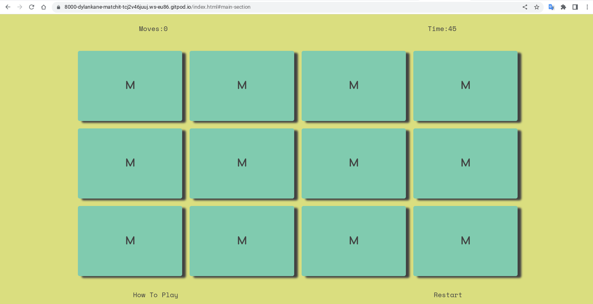

# Testing

Return back to the [README.md](README.md) file.

In this section I will outline the tests I have put this project through, and the results of those tests

## Code Validation

### HTML

I have used the recommended [HTML W3C Validator](https://validator.w3.org) to validate all of my HTML files. I have used the deployed live site to test this.

| Page | URL | Screenshot | Notes |
| --- | --- | --- | --- |
|Single Page|[w3c HTML](https://validator.w3.org/nu/?doc=https%3A%2F%2Fdylankane.github.io%2FMatch-It%2F)||Pass: No Errors

### CSS

I have used the recommended [CSS Jigsaw Validator](https://jigsaw.w3.org/css-validator) to validate all of my CSS files. I have used to live deployed site for this validation test.

| Page | URL | Screenshot | Notes |
| --- | --- | --- | --- |
|Single File|[w3c CSS](https://jigsaw.w3.org/css-validator/validator?uri=https%3A%2F%2Fdylankane.github.io%2FMatch-It%2F)||Pass: No Erorrs| 

### JavaScript

I have used the recommended [JShint Validator](https://jshint.com) to validate all of my JS files.

| File | Screenshot | Notes |
| --- | --- | --- |
|script.js||"One warning 55 Confusing use of '!'". ( on line 57 of the actual script.js file, the validation found the use of the '!' to be confusing I did origanally write it differently, but I found this way to be less confusing)|

## Browser Compatibility

I've tested my deployed project on multiple browsers to check for compatibility issues.

| Browser | Screenshot | Notes |
| --- | --- | --- |
|Chrome||Works as expected|
|Firefox||Works as expected|
|Edge||Scrolling wasnt very smooth but works as expected otherwise|

## Responsiveness

I've tested my live deployed project on multiple devices to check for responsiveness issues.

| Device | Screenshot | Notes |
| --- | --- | --- |
|Mobile (pixel 6a)||Works as expected|
|Tablet landscape (lenovo)||Works as expected|
|Tablet portrait  (lenovo)||Issues with images on cards stretching|
|Laptop (pixelbook)||Works as expected|
|Large Monitor (samsung)||Works as expected|

## Lighthouse Audit

I have also tested my live deployed site using the Lighthouse Audit tool. Done from within he dev tools in chrome. Below are the results.

| Page | Size | Screenshot | Notes |
| --- | --- | --- | --- |
|Single page|Laptop||No warnings |
|Single Page|Mobile||No warnings|

## Defensive Programming

I have manually tested the user interface of this application. The following table shows the different points of interaction, between the user and site, with the test and result.

| Page | User Action | Expected Result | Pass/Fail | Comments |
| --- | --- | --- | --- | --- |
|Single Page site|"Play Game" link in header|scrolls to game board area|pass|works as expected|
|Single Page site|"Restart" link under game board|re-sets game, (shuffle, moves to 0, clock to 45)|pass|works as expected|
|Single Page site|"How To Play" link uneder game board|scrolls to instruction area|pass|works as expected|
|Single Page site|"Play Game" link in intructions area|scrolls to game board and re-sets game |pass|works as expected|
|Single Page site|"Restart" link in time up modal|closes modal and re-sets game|pass|works as expected|
|Single Page site|"Restart" link in congratulations modal|closes modal and re-sets game|pass|works as expected|
|Single Page site|Clicking a card on the game board|Flips the card over and shows image|pass|works as expected|
|Single Page site|clicking a second card on the game board|Flips a second card shows image, locks other cards from being clicked, if matched two card change colour and are disables from being clicked, if not, will flip back over. the board will be unlocked after either outcome, ready for another two clicks|pass| works as expected|

## Bugs

It the development of this project, I came accross a few bugs, some took longer than others to overcome. The biggest bugs were in the javascript side of the application. 

I found getting the logic for locking the board and disabling the cards while the flipping animation was taking place, and checking for matches without the user being able to continue to click other cards or double click the ones that are flipped.

To overcome these issues there was a number solutions I used in conjuction with each other.

Using the 'pointer-events: none' in the css, activated with the javascript code, on cards that have been flipped. i got help with this from my mentor on this project Tim Nelson

Also setting a variable called 'lockBoard' to false and then changing it to true at different points of the main 'FlipCard' function. When it is set to true the 'FlipCard' function will be stopped. This system i found in the code from freecodecamp.org mentioned in the credits section of the README.md file  

## Unfixed Bugs

- An issue that I am still having with the project is fine tuning the responsivness of the game board area. While I have managed to make it fit well on all screen sizes. I feel it could still have a better transition from larger screen sizes to smaller screens. The main issues lie with the move counter and timer counter above the board and the how to play and restart text links below the board, are either too close to the grid on larger screens or if I adjust thier positioning too far away aesthetically on smaller screen sizes. 
The squares have to change aspect at smaller screens to a grid of 3 x 4 from a grid of 4 x 3. Also they reduce in size to fit, but keeping them as squares and not letting them stretch into rectangles, leaves a lot of open space in the small device screens.
  - Possible fix: The use of the css grid properties, could help to make the board more dynamically responsive. Also more adjusting with the flex properties already in use along with more work on the media queries with margins and borders as well.
- In the test on the javascript for this porject, an error or warning was shown, in the jshit validation test. "Confusing use of '!'".  I understand what is beig pointed out here, however another way i had it written originally, I found to actual be mor confusing. It is part of the clock function, with an if/else statement. I decided it read better to check if the clock is not equal to 0 decrement the clock by intervals of 1 second, if it is 0 then activate the times up modal. The order of the statment, makes more sense in my opinion. 
  - Possible fix: It could be written in reverse so the if(!seconds <= 0) would not have to be used, but just if(seconds <= 0) and declare the times up modal before the decrementation of the seconds. I feel this would read wrong.
 
- Commit Messages
  - I am aware of a few mistakes / inconsistencies in my commit messages with typos, and clarity. I became aware of these, and have worked to create short meaningful commit messages from that point on and going forward. 

There are no other bugs or issues that I am currently aware of remaining bugs that I am aware of.
